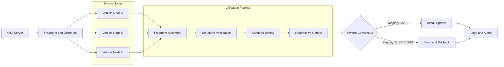

# chimeric-swarm-ota

**Chimeric Swarm Attestation for Secure OTA Updates**
A zero-trust, behavior-aware distributed update validation framework.

## Table of Contents

- [Overview](#overview)
- [Problem](#problem)
- [Solution](#solution)
- [System Architecture](#system-architecture)
- [Workflow](#workflow)
- [Security Features](#security-features)
- [Attack Scenario](#attack-scenario)
- [Example Output](#example-output)
- [License](#license)

## Overview

Modern vehicles receive over-the-air (OTA) updates to improve functionality and fix issues. Current systems rely heavily on digital signatures, which can fail if signing keys are compromised.

Chimeric Swarm OTA introduces a distributed, behavior-aware security model where:

- No single entity is trusted
- Updates are reconstructed collaboratively
- Behavior is verified before execution
- Trust is built progressively

## Problem

- OTA systems are a high-value attack surface
- Signed updates can still be malicious
- Centralized trust creates a single point of failure

## Solution

This project proposes a system that combines:

- Fragmented update distribution
- Swarm-based validation
- Sandbox behavior testing
- Progressive trust control

## System Architecture



## Workflow

1. **Fragmentation** — updates are split into multiple cryptographic fragments.
2. **Swarm Distribution** — fragments are distributed across multiple nodes.
3. **Assembly and Verification** — nodes reconstruct and validate update integrity.
4. **Sandbox Execution** — the update is tested in an isolated environment.
5. **Progressive Control** — permissions are granted step by step.
6. **Consensus Decision** — nodes vote SAFE or SUSPICIOUS.
7. **Final Outcome** — install, or block and roll back.

## Security Features

- Zero-trust architecture
- No single point of failure
- Behavior-based validation
- Distributed consensus
- Automatic rollback

## Attack Scenario

**Malicious but signed update:**

- Passes signature verification
- Contains hidden malicious logic

**Traditional systems:**

- Install update → attack succeeds

**Proposed system:**

- Detects abnormal behavior
- Fails consensus
- Blocks the update

## Example Output

Simulated output from a blocked update:

```
[INFO] Update received
[INFO] Signature verified
[INFO] Running sandbox test
[ALERT] Abnormal behavior detected
[CONSENSUS] Majority suspicious
[DECISION] Update BLOCKED
[ROLLBACK] Reverting to stable version
```

## License

MIT
